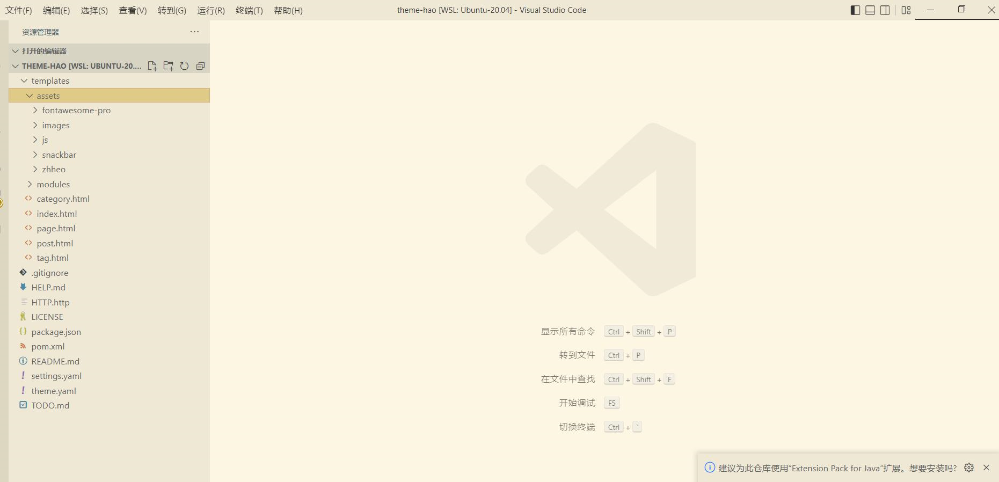

## 本地环境搭建

### 部署 Halo2.0

[使用 Docker 部署](https://docs.halo.run/2.0.0-SNAPSHOT/getting-started/install/docker)

参考相关文档，在本地部署 Halo2.0，主题目录在 `~/halo-next` 下。

本地启动需要添加配置 `-e SPRING_THYMELEAF_CACHE=FALSE` 这样可以关闭缓存，就可以实时刷新主题了。

`-e SPRING_PROFILES_ACTIVE=dev` 则可以打开 swagger-ui。

```
docker run \
  -it -d \
  --name halo-next \
  -p 8090:8090 \
  -v ~/halo-next:/root/halo-next \
  -e HALO_EXTERNAL_URL=http://localhost:8090/ \
  -e HALO_SECURITY_INITIALIZER_SUPERADMINPASSWORD=P@88w0rd \
  -e SPRING_THYMELEAF_CACHE=FALSE \
  -e SPRING_PROFILES_ACTIVE=dev \
  halohub/halo-dev:2.0.0-alpha.1 
```
> windows 电脑下cmd无法识别 \ ，所以需要在wsl2窗口下执行
### 下载主题

下载[halo-theme-hao](https://github.com/liuzhihang/halo-theme-hao)主题，并压缩为 zip 包，然后在 halo console 控制台上传主题，此时可以在
halo 的主题路径下看到刚才上传的主题。

> 路径为
> ~/halo-next/theme
> 如果是windows系统，那么主题文件是在wsl2的系统里面的，可以通过vscode或者idea直接打开wsl2里面对应的主题文件夹
> 
### 如何动态更新配置

参考 HTTP.http 文件

1. 在 console 后台获取到 cookie
2. 调用删除 settings 接口
3. 将新的配置放在 yaml 转 json，然后调用 post 接口

### 参考主题

> 可以参考相关主题的用法

Halo 官方默认主题：https://github.com/halo-sigs/theme-default

Hexo-Butterfly 主题：https://github.com/jerryc127/hexo-theme-butterfly
