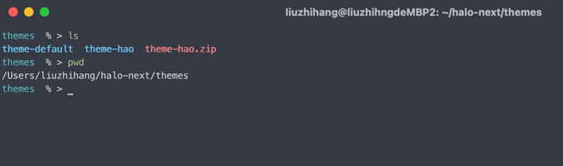

## 本地环境搭建

### 部署 Halo2.0

[使用 Docker 部署](https://docs.halo.run/2.0.0-SNAPSHOT/getting-started/install/docker)

参考相关文档，在本地部署 Halo2.0，主题目录在 `~/halo-next` 下。

本地启动需要添加配置 `-e SPRING_THYMELEAF_CACHE=FALSE` 这样可以关闭缓存，就可以实时刷新主题了。

`-e SPRING_PROFILES_ACTIVE=dev` 则可以打开 swagger-ui。

访问地址：[http://localhost:8090](http://localhost:8090)

后台地址：[http://localhost:8090/console](http://localhost:8090/console)

文档地址：[http://localhost:8090/swagger-ui.html](http://localhost:8090/swagger-ui.html)

```
docker run \
  -it -d \
  --name halo-next \
  -p 8090:8090 \
  -v ~/halo-next:/root/halo-next \
  -e HALO_EXTERNAL_URL=http://localhost:8090/ \
  -e HALO_SECURITY_INITIALIZER_SUPERADMINPASSWORD=P@88w0rd \
  -e SPRING_THYMELEAF_CACHE=FALSE \
  -e SPRING_PROFILES_ACTIVE=dev \
  halohub/halo-dev:2.0.0-alpha.1 
```

> windows 电脑下cmd无法识别 \ ，所以需要在wsl2窗口下执行

### 热部署

下载[halo-theme-hao](https://github.com/liuzhihang/halo-theme-hao)主题

#### 方式一

压缩为 zip 包，然后在 halo console 控制台上传主题，此时可以在 halo 的主题路径下看到刚才上传的主题，名称为 `theme-hao`。

halo 的主题路径：

1. mac 默认在 ~/halo-next/theme
2. windows 默认在 wsl2 中




可以通过 IDEA 或者 vscode 直接打开主题文件夹，进行操作开发，这里会实时生效。

#### 方式二

1. 直接在主题目录(~/halo-next/theme)下 git pull 代码，然后重命名为 `theme-hao`。 此时打开 console 控制台是看不到这个主题的，（halo
   后面会添加扫描主题功能）
2. 通过 http 接口，将 theme.yaml 的配置提交，接口可以参考 swagger-ui
3. 可以参考 http/theme.http 内的脚本

### 如何动态更新配置

通过以上过程，在修改前端代码时，已经可以实时看到效果，但是当修改了 settings.yaml 配置后，发现在前端并不能直接通过 thymeleaf
获取到字段值，这里就需要调用接口修改 console 后台的配置。

参考 http/settings.http 文件

1. 在 console 后台获取到 cookie
2. 调用删除 settings 接口
3. 将新的配置放在 yaml 转 json，然后调用 post 接口

### 参考主题

> 可以参考相关主题的用法

Halo 官方默认主题：https://github.com/halo-sigs/theme-default

Hexo-Butterfly 主题：https://github.com/jerryc127/hexo-theme-butterfly
